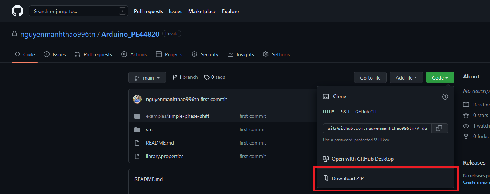
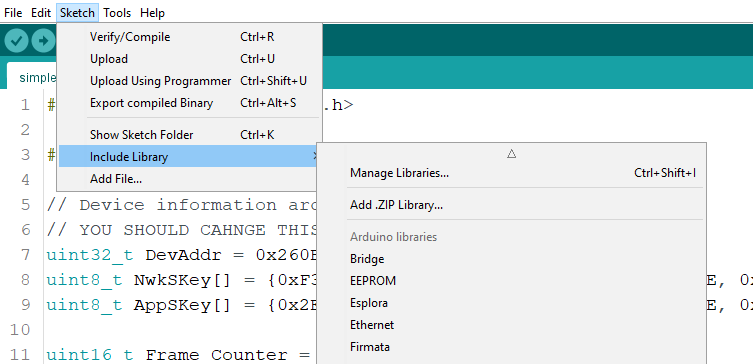
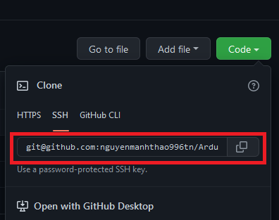
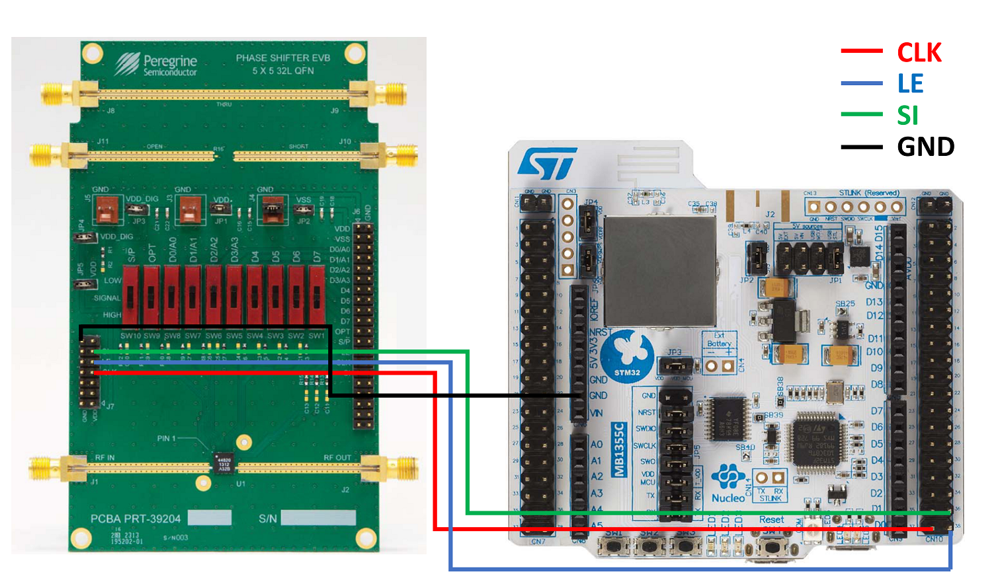

# Arduino PE44820
An Arduino library to control a single digital phase shifter PE44820 from Peregrine Semiconductor. The library requires only normal IOs feature (without External Interrupts) to work.

# Installation
You can either install this library by using Arduino .ZIP Library import feature or cloning directly into your Arduino Library folder.

## Method 1: Use Arduino .ZIP Library import feature (Recommended)

* <b><u>Step 1</b></u>: Download this reposistory as a zip file


* <b><u>Step 2</b></u>: In Arduino IDE, select <b>Sketch -> Include Library -> Add .ZIP Library..</b> Browse to the zip archive downloaded in Step 1 and import.


For further instructions, refer to [this guide](https://docs.arduino.cc/software/ide-v1/tutorials/installing-libraries) from Arduino CC.

## Method 2: Clone this repository directly into your Arduino Library folder

<b><u>Step 1</b></u>: Open Git Bash and navigate to the Arduino Library folder. Default folder on Windows:
```
C:\Users\<username>\Documents\Arduino\libraries
```

<b><u>Step 2</b></u>: Copy the reposistory clone URL and clone with this command
```
git clone git@github.com:nguyenmanhthao996tn/Arduino_PE44820.git
```


# Hardware Setup

To control 1 Phase Shifter in Serial mode, it requires 4 wires:
- CLK
- LE
- SI
- GND

To put the Phase Shifter in Serial mode, refer to the [PE44820 Datasheet](https://www.psemi.com/pdf/datasheets/pe44820ds.pdf) or the [PE44820 EVK User’s Manual](https://www.psemi.com/pdf/eval_kit/manual/PE44820evk.pdf).



<i>In the example, I used the PE44820 EVK and P-NUCLEO-WB55</i>

# To-do
- [ ] Multiple in-serial phase shifters control (SDO1 & SDO2)

<i>Have a good day! CGT</i>
